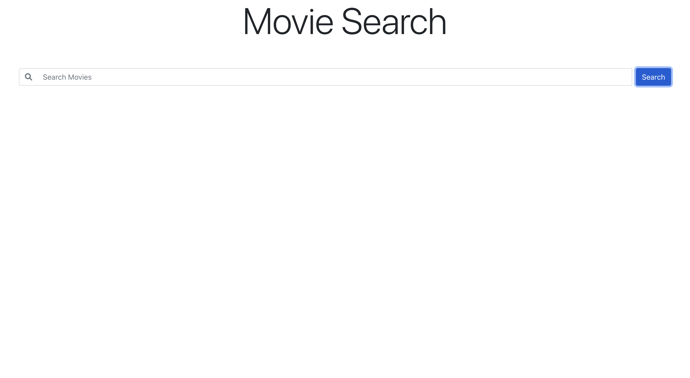
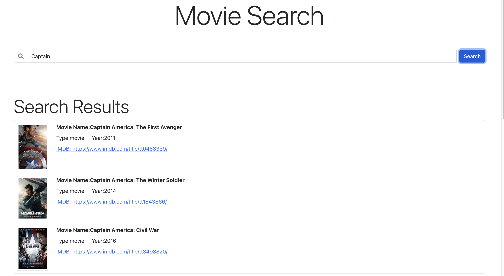

# Movie Search on OMDB API

This product allows you to search movies from OMDB platform.

# Setup

- You need to create a config.js file in src folder, which contains your configurations such as API Keys.
- Install all the required packages mentioned in package.json.
- You can good to go.

# Preview

# Live Demo

TODO: Update Link

# Copyright

All the contents of this repository is subject to copyright and proper citation is mandated.